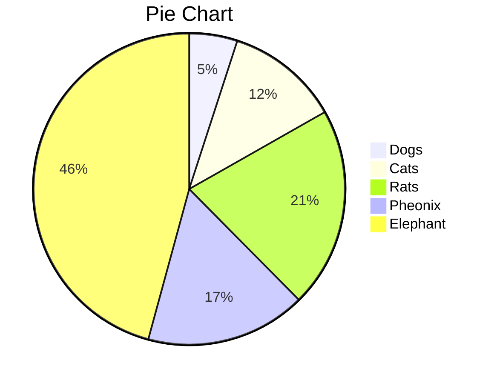

# Genius Runner

* [英文版](/pRoJEct-VeXEd/index/)

 
> 🏃‍♀️🏃 love running, love life, love to share 🏃‍♀️🏃

## What

`Genius Runner`是一款`WEB 3`生活方式的应用程序,带有社交和游戏元素,玩家可以通过户外散步、慢跑或跑步方式赚取可观的收入.

## Why

## Where

* [Android](www.google.com)
* [IOS](www.google.com)

## How
### 应用数据

| 指标         | 值|
| :----------- | :-------- |
| 跑动距离 (M) | 4,233,434,322.23 |
| 碳抵消 (KG) | 540,000.232 |
| 燃烧的卡路里 (KCAL) | 764,343,232.12 |
| Discord成员 | 155,43  |
| Telegram成员 | 134,23 |
| Twitter粉丝 | 233,323|

### 路线图

#### 第一阶段

#### 第二阶段

#### 第三阶段

#### 第四阶段

### 代币经济学

#### ISPO

> [Wallet教程](/pRoJEct-VeXEd/wallet-cn/)

参加`ISPO`可以赢取空投

| 池代码  | 类型|  状态 |
| :----------- | :-------- | :-------- |
| xxx | `100% GENS` | Active-Saturated |
| yyy | `50% GENS / 50% ADA` | Inactive |

## Who

### 团队

### 顾问

### 支持者

### 合作伙伴

